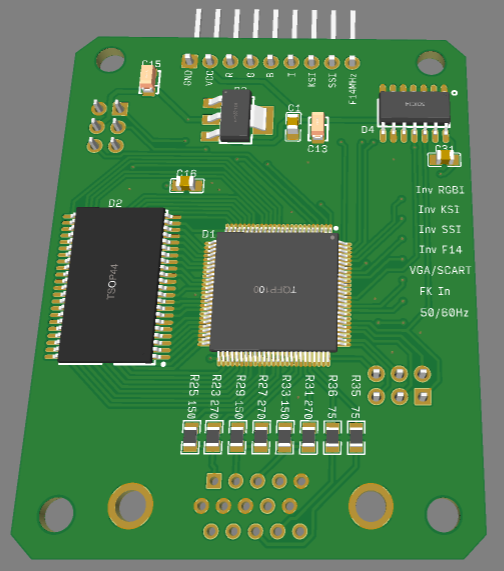

# RGB2VGA

В данном репозитории представлен проект конвертера RGB -> VGA, предназаначенный для подключения клонов компьютеров ZX Spectrum, а так же ряда других любительских компьютеров к VGA-мониторам.

Автор разработки *zx-kit*. Подробнее с разработкой можно ознакомиться на форуме [zx-pk.ru](https://zx-pk.ru/threads/10548-zxkit1-plata-vga-amp-pal.html). Там же можно найти и прошивки к CPLD.

Часть схемы, отвечающая за PAL-кодек, исключена.

[Исходники](Sources)

[Готовые схемы](Export)

[Герберы](Gerber)

[Telegram](https://t.me/zs_scorpion)

## Изменения
* v 2.0.2 По просьбе Mikka_a, на плату установлен нормальный разъем JTAG. Поправлена шелкография перемычек.
